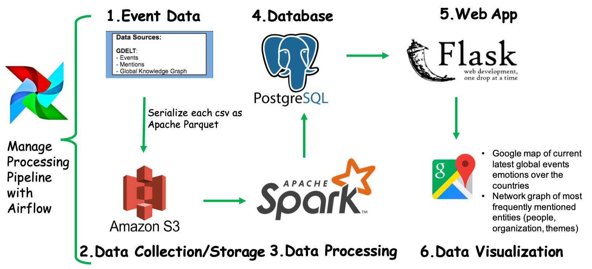

# Sentimental Analytics of World's News

A project to visualize how emotion changes over the countries and over the time

[PresentationLink](https://docs.google.com/presentation/d/17kqqoi366-yGY37D6kvjkp5ljShZHSOSuFEpI18jUYA/edit#slide=id.p) 

## How to install and get it up and running

## Introduction
The GDELT dataset provides data on historic and current events. It classifies this data into different categories and scales the impact and tone of the event using goldstein scale. My project is to provide a platform to view the current topics and determine the impact to a country over time using GDELT events datasets. positive/negative emotion surrounding the leaders, policies or daily life in general. 

## Architecture

S3, Python, Spark, PostgreSQL, Flask

## Dataset
Global Database of Events, Language, and Tone (GDELT) project - a realtime database of global society. Over 2.5TB for last year alone. 
three datasets:
    •Events, 51 columns
    •Mentions
    •Global Knowledge Graph
## Engineering challenges
1) Understand Source files Data
2) how to efficiently store and fast processing the files
3) Source files schema changes over times
4) Debuggability, using Airflow to help with debuggability

## Trade-offs

